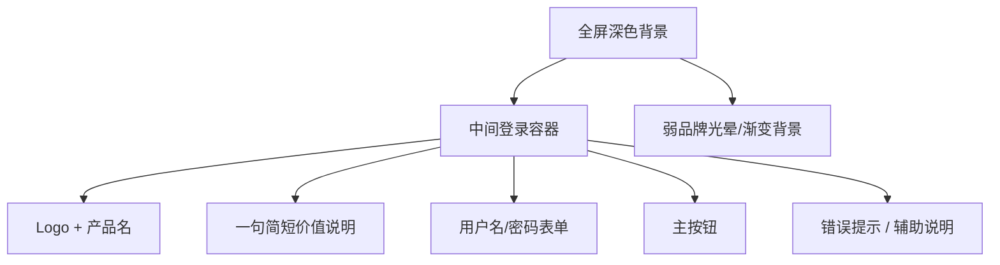
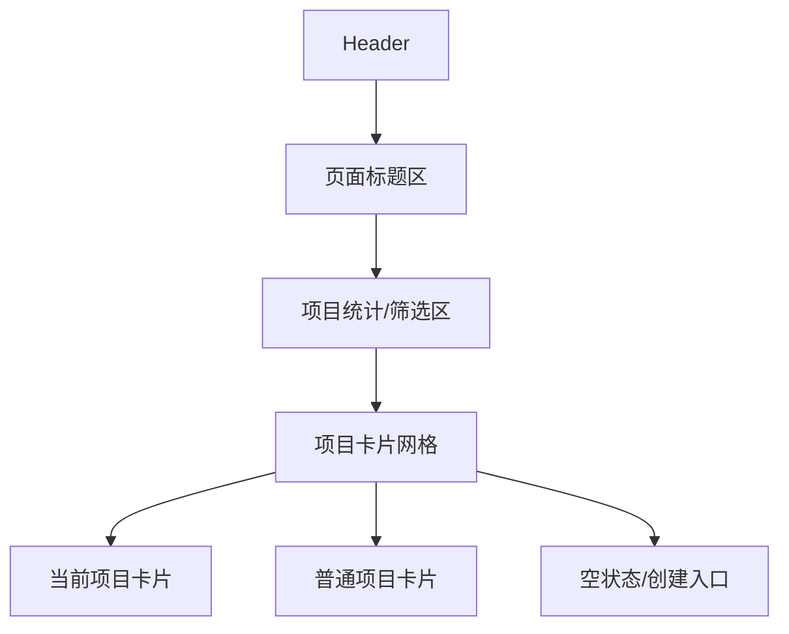
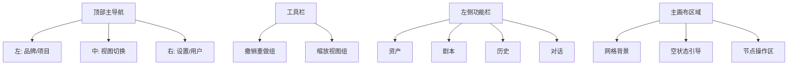

# UI 规范草案与改版执行方案

适用项目: `aigc-coop-fronted`

目标:
- 统一登录页、项目页、画布页的视觉语言
- 把当前“工程化原型”收敛为“稳定的产品级创作工具界面”
- 让后续样式改造可以按组件和页面逐步落地

---

## 1. 当前判断

### 1.1 现状结论
- 当前 UI 可用，但页面之间成熟度不一致。
- 登录页偏标准后台登录框。
- 项目页偏信息卡片墙，但层级弱。
- 画布页有工具产品雏形，但 chrome 过重、分组不清、精致度不足。

### 1.2 核心问题
- 缺少页面级统一骨架。
- 缺少组件级视觉规范，按钮、卡片、标签、顶部栏、工具栏各自为政。
- 深色层次偏平，`bg/surface/elevated` 之间差异不够。
- 品牌表达弱，只剩 logo 和蓝色主色。
- 信息密度和视觉密度没有统一控制。

---

## 2. UI 规范草案

## 2.1 设计原则
- `Dark-first`: 以深色创作工具为基础，不做普通后台。
- `Low-noise`: 减少高对比边框和杂散控件，优先用层级和分组表达结构。
- `Clear hierarchy`: 页面标题、区域标题、卡片标题、辅助信息必须有稳定层级。
- `Tool-grade`: 画布和工具类页面优先强调可操作性和专注度，而不是装饰。
- `Brand-presence`: 品牌蓝保留，但只作为主行动和焦点，不满屏铺蓝。

## 2.2 色彩规范

### 基础层级
- `bg/base`: `#0B0D12`
- `bg/subtle`: `#11161D`
- `surface/1`: `#18202B`
- `surface/2`: `#202A36`
- `surface/3`: `#273444`
- `border/default`: `rgba(255,255,255,0.08)`
- `border/strong`: `rgba(255,255,255,0.14)`

### 品牌色
- `brand/500`: `#1292FF`
- `brand/600`: `#0B7DE0`
- `brand/soft`: `rgba(18,146,255,0.16)`
- `brand/glow`: `rgba(18,146,255,0.28)`

### 文字色
- `text/primary`: `rgba(255,255,255,0.94)`
- `text/secondary`: `rgba(255,255,255,0.68)`
- `text/tertiary`: `rgba(255,255,255,0.46)`
- `text/inverse`: `#0B0D12`

### 语义色
- `success`: `#27C281`
- `warning`: `#F5A524`
- `danger`: `#F15B6C`
- `info`: `#5AA9FF`

### 使用规则
- 大面积区域不用纯黑 + 纯灰硬切，使用 3 层深色表面。
- 蓝色只用于:
  - 主按钮
  - 当前激活态
  - 聚焦态
  - 关键状态标签
- 删除、警告、错误状态只在需要时出现，避免抢主视觉。

## 2.3 排版规范

### 字号层级
- `Display`: 32/40, 700
- `Page Title`: 24/32, 700
- `Section Title`: 18/26, 600
- `Card Title`: 16/24, 600
- `Body`: 14/22, 400
- `Meta`: 12/18, 500

### 文本规则
- 页面标题必须稳定出现在页面主区域顶部。
- 描述文字只用 `text/secondary`。
- Meta 信息统一使用 12px，不和正文抢权重。
- 中文产品名称统一，不再混用 `Huanu Canvas`、`AIGC Coop`、`项目管理` 多套命名风格。

## 2.4 间距规范
- 基础单位: `4px`
- 组件内边距:
  - 紧凑: `8-12px`
  - 标准: `12-16px`
  - 宽松: `20-24px`
- 页面区块间距:
  - 标准页面: `24px`
  - 大区块: `32px`

## 2.5 圆角规范
- `sm`: `8px`
- `md`: `12px`
- `lg`: `16px`
- `xl`: `20px`
- 卡片默认使用 `16px`
- 顶栏小按钮和表单控件使用 `12px`

## 2.6 阴影与描边规范
- 默认不使用重阴影。
- 主要靠表面层级和轻描边区分。
- 选中态使用:
  - `1px` 品牌描边
  - 外层 `brand soft glow`

## 2.7 组件规范

### Button
- Primary: 品牌蓝实底
- Secondary: 深色表面 + 轻边框
- Ghost: 无底，仅 hover 表面
- Danger: 仅用于破坏性操作

### Card
- 背景使用 `surface/1`
- hover 提升到 `surface/2`
- 选中态加品牌描边和弱 glow
- 操作按钮默认弱化，hover 才增强

### Tag / Status
- 使用低饱和胶囊标签
- `当前项目`、`进行中`、`已完成`、`异常` 颜色分离
- 避免多个强色标签同时出现

### Top Bar
- 高度固定
- 左中右三区明确:
  - 左: 品牌 + 项目上下文
  - 中: 视图切换
  - 右: 设置 + 用户

### Tool Bar
- 画布工具按组分段
- 缩放、撤销重做、视图控制不要散落
- 每组之间有清晰分隔

---

## 3. 三页改版方向图

## 3.1 登录页方向

定位:
- 从“标准后台登录框”改为“创作工作台入口”

目标气质:
- 安静、专业、轻品牌感、不是营销页

方向图:

结构建议:
- 背景增加弱渐变和极轻图形噪声，避免纯黑空场。
- 登录卡片更薄更精致，减少厚重边框。
- logo 与标题之间建立更强品牌识别。
- 输入框和按钮统一高度与圆角。

视觉关键词:
- 聚焦
- 稳定
- 创作工具入口

## 3.2 项目页方向

定位:
- 从“卡片列表页”改为“项目启动台”

目标气质:
- 清晰、可浏览、重点突出当前项目

方向图:

结构建议:
- 标题区与操作区分开，不要全挤在一个横条里。
- 项目列表上方增加轻量摘要，如项目数、最近更新、当前项目。
- 当前项目卡片单独强调，不只靠一枚小标签。
- 卡片内部采用固定层级:
  - 标题
  - 描述
  - 时间/状态
  - 操作

视觉关键词:
- 启动台
- 清晰层级
- 低噪声卡片系统

## 3.3 画布页方向

定位:
- 从“能工作的画布”改为“专业创作工作台”

目标气质:
- 专注、克制、工具化

方向图:

结构建议:
- 顶栏更扁平，更统一，不要既像站点导航又像系统菜单。
- 画布上方工具栏单独成层，不和主导航混在一起。
- 左侧悬浮栏改为更稳定的工具架视觉，避免像孤立悬浮胶囊。
- 底部快捷提示区做成更轻的 help bar，不要喧宾夺主。

视觉关键词:
- 专业工具
- 可控
- 稳定的操作层次

---

## 4. 一轮可直接落地的样式改造清单

## 4.1 P0: 设计基础层

目标:
- 先统一 token 和基础组件，不先做细枝末节

执行项:
- 在 `tailwind.config.js` 里补齐新的深色层级和文本层级 token
- 增加统一阴影、边框透明度、表面层级变量
- 在全局样式里统一 focus、hover、disabled 规则
- 建立通用按钮样式约定
- 建立通用卡片样式约定

涉及文件:
- [tailwind.config.js](D:\work\Huanu\VibeCode\aigc-coop-fronted\tailwind.config.js)
- [index.html](D:\work\Huanu\VibeCode\aigc-coop-fronted\index.html)
- `src/index.css` 或全局样式入口

## 4.2 P0: 登录页收敛

执行项:
- 弱化边框厚度，改成更轻的表面层级
- 增加背景氛围，不再纯黑
- 统一输入框与按钮高度
- 标题、副标题、表单标签形成稳定层级
- 错误提示改成轻量 inline alert，而不是高对比红块

涉及文件:
- [LoginPage.tsx](D:\work\Huanu\VibeCode\aigc-coop-fronted\src\pages\LoginPage.tsx)

完成标准:
- 登录页不再像默认后台模板
- 品牌识别比现在更强

## 4.3 P0: 项目页卡片系统重做

执行项:
- 把 header 分成:
  - 左侧标题区
  - 右侧操作区
- 项目卡片重排层级
- 当前项目卡片强化
- 状态标签统一样式
- 编辑/删除按钮默认弱化，只在 hover 显示高亮
- 空状态做成更完整的引导模块

涉及文件:
- [ProjectsPage.tsx](D:\work\Huanu\VibeCode\aigc-coop-fronted\src\pages\ProjectsPage.tsx)
- [ProjectCard.tsx](D:\work\Huanu\VibeCode\aigc-coop-fronted\src\features\projects\ProjectCard.tsx)
- `ProjectDetail.tsx`
- `ProjectModal.tsx`

完成标准:
- 首页主次明确
- 当前项目一眼可识别
- 卡片墙不再显得“平铺”

## 4.4 P1: 画布页 chrome 收敛

执行项:
- 顶栏重排成标准三段式
- 视图切换按钮统一尺寸、间距、激活态
- 用户区和设置区弱化视觉噪声
- 工具栏按组做分隔
- 左侧功能栏改成一致的工具架样式
- 底部 help 区弱化，减少存在感

涉及文件:
- [Header.tsx](D:\work\Huanu\VibeCode\aigc-coop-fronted\src\components\layout\Header.tsx)
- `Sidebar.tsx`
- `CanvasToolbar.tsx`
- `Canvas.tsx`

完成标准:
- 画布 chrome 更像专业工具
- 导航、工具、帮助信息不再互相争抢注意力

## 4.5 P1: 文案和命名统一

执行项:
- 统一产品命名:
  - 品牌名
  - 页面标题
  - 按钮文案
- 清理中英混用和内部测试式命名
- 避免“后台系统”和“创作工具”两种语气混用

涉及文件:
- [Header.tsx](D:\work\Huanu\VibeCode\aigc-coop-fronted\src\components\layout\Header.tsx)
- [LoginPage.tsx](D:\work\Huanu\VibeCode\aigc-coop-fronted\src\pages\LoginPage.tsx)
- [ProjectsPage.tsx](D:\work\Huanu\VibeCode\aigc-coop-fronted\src\pages\ProjectsPage.tsx)

## 4.6 P2: 细节增强

执行项:
- 统一 icon 尺寸与描边风格
- 补骨架屏或更优雅的 loading
- 补 hover/active/selected 的微交互一致性
- 统一 modal 和 panel 的进入/退出节奏

---

## 5. 建议实施顺序

### Sprint 1
- token 收敛
- 按钮/卡片/标签规范
- 登录页改版

### Sprint 2
- 项目页改版
- 项目卡片体系重做

### Sprint 3
- 画布页顶部栏和工具栏收敛
- 左侧功能架优化

---

## 6. 交付标准

这轮改造完成后，至少要满足:
- 三个核心页面看起来像同一个产品
- 当前项目、主操作、辅助操作的层级一眼清楚
- 深色主题不再“只有黑和蓝”
- 登录页具备品牌感，项目页具备启动台感，画布页具备专业工具感

---

## 7. 下一步建议

如果进入实现阶段，建议直接按下面顺序改代码:
1. 先改 token 和全局规范
2. 再改登录页
3. 再改项目页
4. 最后改画布页 chrome

这样风险最小，也最容易保持视觉一致。
